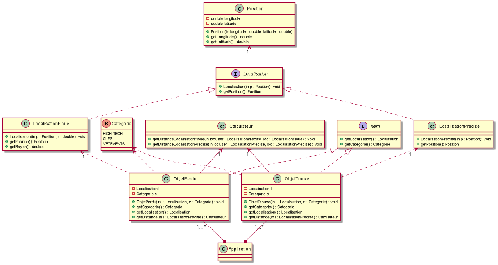

= Cahier des spécifications

== Partie 1 : Synthèse

=== Le projet

Nous vous présentons notre projet, (titre du projet, logo, abréviation)

=== Membres de l'équipe

Notre équipe est composée de 4 étudiants Master 1 MIAGE de l'université Paris Nanterre. Fatimata Soumaré, Rizlane Abalil, Raphael Meissonnier et Imane Kadi.

=== Présentation

Il nous est à tous arrivé de perdre un objet, se dire que ce serait génial qu'une personne le trouve et nous contacte pour nous le rendre, ou même de trouver un objet et de vouloir le rendre au propriétaire avec un moyen simple. Nous avons donc mis en place ce projet pour répondre à cette problématique. L'objectif est de créer une plateforme qui va permettre aux utilisateurs de gagner du temps et de l'argent dans leurs démarches à propos d'un objet perdu ou trouvé.
Le fait que ce projet traite un problème dont la plupart de la population mondiale a déja été confronté motive notre équipe à délivrer une solution et ainsi simplifier la vie des gens.
Bien que ce problème touche tout le monde, il existe peu de solutions efficaces, souvent elles ne sont pas  optimales  au niveau du temps comme les services physiques d'objets trouvés ( SNCF, RATP, Police...). Il existe tout de même des applications telles que Troov, ou Ppbot.

=== Personas et fonctionnalités de leur point de vue

  1) Premier persona ( Utilisateur Perdu ) :
  - Il peut créer son espace personnel et s'y connecter.
  - Il peut aussi remplir un formulaire via son espace personnel pour déclarer un objet qu'il a perdu.
  - Il peut faire une recherche via le moteur de recherche.
  - Il peut trier et filtrer ses recherches par caractéristiques, catégories, date d'ajout.
  - Il peut consulter la liste correspondante à sa recherche.
  - Il peut consulter la fiche d'un objet.
  - Il peut contacter le trouveur de l'objet via la fiche de l'objet.
  - Il peut recevoir des notifications lorsqu'il reçoit un message via sa messagerie.
  - Il peut via cette messagerie discuter avec des potentiels propriétaires d'objets trouvés.
  - S'il pense avoir trouvé son objet, il peut remplir un formulaire de test d'auhentification de propriétaire.
  - S'il réussi ce test, il peut fixer un rendez-vous dans son agenda via son espace.
  - Il peut supprimer son annnonce via son espace personnel.

  2) Deuxième persona ( Utilisateur Trouveur ) :
  - Il peut créer son espace personnel et s'y connecter.
  - Il peut aussi remplir un formulaire via son espace personnel pour déclarer un objet qu'il a trouvé.
  - Il peut recevoir des notifications lorsqu'il reçoit un message via sa messagerie.
  - Il peut via cette messagerie discuter avec des potentiels propriétaires d'objets trouvés.
  - Si ce potentiel propriétaire répond correctement au test d'auhentification de propriétaire, alors l'utilisateur peut fixer un rendez-vous dans son agenda via son espace.
  - Il peut aussi mettre en place un alerte correspondant à ce rendez-vous.
  (- Son solde de points de fidelité sera augmenté à chaque fois qu'un de ses objets qu'il a trouvé est restitué au propriétaire.)

  3) Troisième persona ( Administarteur Web ) :

=== prévisions marketing (comment prévoyez vous de pousser votre projet auprès des utilisateurs, réseaux sociaux, enquêtes, flyers, site Web, etc)
//Vision trop large ??
La cible de notre produit est principalement les utilisateurs des transports en commun. Pour cela, nous mettrons des affiches dans les transports en commun, les gares, sur la façades des bus avec des QRcodes pour diriger plus facilement les utilisateurs de toute tranche d'âge vers notre plateforme. De plus, nous avons décidé de lancer une campagne publicitaire sur les réseaux sociaux. Pour cela, nous opterons pour des placements de produits via Instagram, Facebook mais aussi en créant une page sur chacune de ces plateformes et ce pour meiux cibler la tranche des 16-35 ans. Nous comptons aussi sur les bonnes vieilles méthodes telles que le bouche à oreilles.

== Partie 2 : Aspects techniques

PerdUPN est une application web développée en :
    - JavaScript avec React JS pour le front-end
    - Express JS pour le back-end. 

Les tests se feront avec : 

    - Jest pour le back-end
    - Mocha pour le front-end 

Lien métier/API ?

Métier/persistance ?

plateforme opérationnelle (gestion de versions=git, build=npm, qualité de code=sonarQube, CI = Travis CI)

Nous allons utiliser plusieurs API distantes telles que OpenLayers pour la carte.

== Partie 3 : Modélisation

=== Maquette du front

=== Diagramme de classe

=== Description de l'API

=== Diagramme de séquence