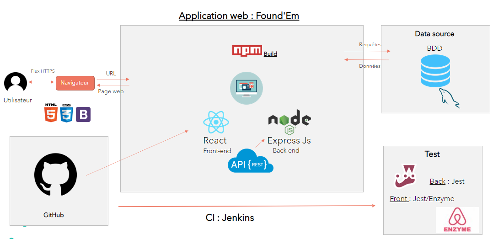
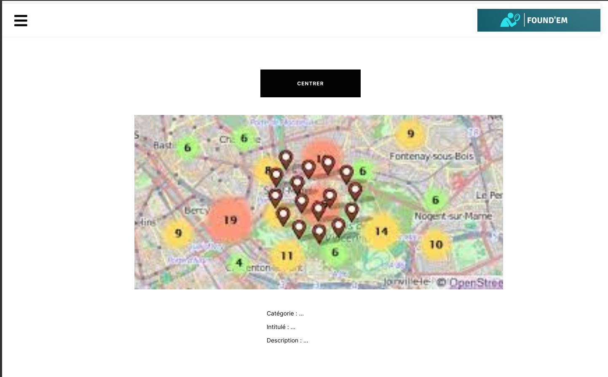

= Cahier des spécifications

== Partie 1 : Synthèse

=== Le projet

Nous vous présentons notre projet qui est une application nommée Found'em.

image::logo.png[]

=== Membres de l'équipe

Notre équipe est composée de 4 étudiants Master 1 MIAGE de l'université Paris Nanterre. Fatimata Soumaré, Rizlane Abalil, Raphael Meissonnier et Imane Kadi.

=== Présentation

Il nous est à tous arrivé de perdre un objet, se dire que ce serait génial qu'une personne le trouve et nous contacte pour nous le rendre, ou même de trouver un objet et de vouloir le rendre au propriétaire avec un moyen simple. Nous avons donc mis en place ce projet pour répondre à cette problématique. L'objectif est de créer une plateforme qui va permettre aux utilisateurs de gagner du temps et de l'argent dans leurs démarches à propos d'un objet perdu ou trouvé.
Le fait que ce projet traite un problème dont la plupart de la population mondiale a déja été confronté motive notre équipe à délivrer une solution et ainsi simplifier la vie des gens.
Bien que ce problème touche tout le monde, il existe peu de solutions efficaces, souvent elles ne sont pas  optimales  au niveau du temps comme les services physiques d'objets trouvés ( SNCF, RATP, Police...). Il existetout de même des applications telles que Troov, ou Ppbot.

=== Personas et fonctionnalités de leur point de vue

  Utilisateur :
  - Il peut créer son espace personnel et s'y connecter.
  - Il peut aussi remplir un formulaire via son espace personnel pour déclarer un objet qu'il a perdu ou qu'il a trouvé.
  - Il peut faire une recherche via le moteur de recherche.
  - Il peut trier et filtrer ses recherches par caractéristiques, catégories, date d'ajout.
  - Il peut consulter la liste correspondante à sa recherche.
  - Il peut consulter la fiche d'un objet.
  - Il peut contacter le trouveur de l'objet via la fiche de l'objet.
  - Il peut recevoir des notifications lorsqu'il reçoit un message via sa messagerie.
  - Il peut via cette messagerie discuter avec des potentiels propriétaires d'objets trouvés.
  - S'il pense avoir trouvé son objet, il peut remplir un formulaire de test d'auhentification de propriétaire.
  - S'il réussi ce test, il peut fixer un rendez-vous dans son agenda via son espace.
  - Il peut supprimer son annnonce via son espace personnel.
  - Son solde de points de fidelité sera augmenté à chaque fois qu'un de ses objets qu'il a trouvé est restitué au propriétaire.

  Administrateur Web :
  - Signaler un utilisateur
  - Bannir de l'application un utlisateur
  - Supprimer une annonce
  - Consulter KPI (nombres d'objets perdus, retrouvés, pourcentage objets restitués, ...)
  - Attribuer des points de fidélité
  - Contacter un utilisateur via la messagerie
  - Ajouter des blocs de messages
  - Consulter les avis des utilisateurs

=== Prévisions marketing
//Vision trop large ??

La cible de notre produit est principalement les utilisateurs des réseaux. Pour cela, nous lancerons une campagne publicitaire sur les réseaux sociaux. Nous comptons aussi sur la bonne vieille méthode du bouche à oreille.

== Partie 2 : Aspects techniques

Found'em est une application Web.

=== Schéma d'architecture

=== Plateforme technologique

Found'em est développée en :

    - JavaScript avec React JS pour le front-end.
    - Express JS pour le back-end. 

Les tests se feront avec : 

    - Jest pour le back-end
    - Jest/Enzyme pour le front-end

L'ORM utilisé pour le lien entre la base de données et le code métier est Sequelize.

ExpressJS fera le lien métier et l'API.

La base de données sera en MySql.

=== Plateforme opérationnelle 

-> Gestion de versions :: Git
-> Le build :: npm
-> La qualité de code :: sonarCloud
-> CI :: Jenkins

Nous allons utiliser plusieurs API distantes telles que OpenLayers pour la cartographie (map) ou encore MapBox pour le Geocoding.

Concernant l'IA, nous pourrons comparer et mettre en relation des déclarations de pertes et déclarations d'objets perdus similaires.
Nous pourrons retrouver la personne dans la base de données grâce à certains objets (carte bancaire, CNI etc...).
Nous pourrons également identifier les objets perdus grâce aux photos.

== Partie 3 : Modélisation

=== Maquette du front

Je clique sur le bouton "J'ai trouvé un objet".
Je suis redirigé sur une nouvelle page "Un objet retrouvé ?".

Je remplis le formulaire détaillé.
Je valide.
Je suis redirigé vers la page d'accueil.

Lorsque l'utilisateur dézoome la carte, les icônes fusionnent.

J'ai trouvé un objet perdu.
Je signale cet objet sur l'application web Found'em.
Je suis sur la page d'accueil Home de Found'em.
Je clique sur le bouton "J'ai trouvé un objet".
Je suis redirigé sur une nouvelle page "J'ai trouvé un objet".
Je remplis le formulaire détaillé.
Je valide.

L'utilisateur pourra distinguer les points sur la carte.
Chaque point sur la carte correspondra à un objet perdu.
L'utilisateur pourra avoir des informations sur l'objet perdu en question.
L'utilisateur pourra centrer la map.

L'utilisateur accède à la page d'accueil du site
L'utilisateur clique sur le bouton 'J'ai perdu un objet"
L'utilisateur est redirigé vers une nouvelle page
L'utilisateur rempli le formulaire
L'utilisateur valide les informations saisies en cliquant sur le bouton "Valider"

L'utilisateur accède à la page d'accueil du site
L'utilisateur clique sur le bouton 'J'ai perdu un objet"
L'utilisateur est redirigé vers une nouvelle page
L'utilisateur accède au formulaire permettant de chercher un objet perdu.
Il saisit un intitulé et coche des informations concernant l'objet.
L'utilisateur valide sa recherche avec le bouton "rechercher".
Des résultats correspondant aux informations s'affichent.

L'utilisateur accède à la page d'accueil
L'utilisateur choisit un rayon
L'utilisateur consulte les nouveaux objets affichés sur la carte

L'utilisateur accède à la page d'accueil
L'utilisateur clique sur la rubrique "Me connecter"
L'utilisateur saisit les champs du formulaire
L'utilisateur clique sur le bouton "Me connecter"
L'utilisateur est connecté
L'utilisateur est redirigé vers une nouvelle page

L'utilisateur accède à la page d'accueil
L'utilisateur clique sur la rubrique "Créer un compte"
L'utilisateur est redirigé vers une nouvelle page
L'utilisateur saisit les champs du formulaire
L'utilisateur clique sur le bouton "Valider"
Le compte de l'utilisateur est créé
L'utilisateur est redirigé vers la page d'accueil

L'utilisateur accède à la page d'Accueil
L'utilisateur consulte la liste des objets perdus proches de sa localisation

=== Diagramme de classe

=== Description de l'API

|===
|Définition |Description

|GET
/objets/:longitude/:latitude/:rayon
|La réponse retourne un tableau d'objets triés selon leur distance par rapport à l'utilisateur.
|POST
/localisation
|La requête envoie la localisation de l'utilisateur
|GET
/objets/:longitude/:latitude
|La réponse retourne un tableau d'objets perdus triés selon leur distance par rapport à l'utilisateur
|POST
/ajoutObjetTrouve
|La requête envoie les informations d'un objet trouvé saisies par l'utilisateur
|POST
/ajoutObjetPerdu
|La requête envoie les informations d'un objet perdu saisies par l'utilisateur
|GET
/chercherObjetPerdu/:intitule/:categorie/:date/:longitude/:latitude
|La réponse retourne une collection d'objets trouvés correspondant à des critères

|===

=== Diagramme de séquence

Feature "Localiser l'utilisateur"

image::diagrammes/séquences/DS_localisation_user.png[width=600,height=400]

Feature "Afficher les objets les plus proches"

image::diagrammes/séquences/DS_objets_plus_proches.png[width=600,height=400]

Feature "Voir les points fusionnés"

image::diagrammes/séquences/DS_points_collapses.png[]

Feature "Voir Informations d'un Item"

image::diagrammes/séquences/DS_informations_item.PNG[width=400,height=300]

Feature "Declarer un Objet Trouvé"

image::diagrammes/séquences/DS_ajout_objet_trouve.PNG[]

Feature "Declarer un Objet Perdu"

image::diagrammes/séquences/DS_ajout_objet_perdu.png[]

Feature "Rechercher un Objet Perdu"

image::diagrammes/séquences/DS_recherche_items.PNG[]

Feature "Choisir le rayon des objets"

image::diagrammes/séquences/DS_choisir_rayon_items.png[]

Feature "Consulter les suggestions d'objets perdus"

image::diagrammes/séquences/DS_suggestion_items_perdus.PNG[]

